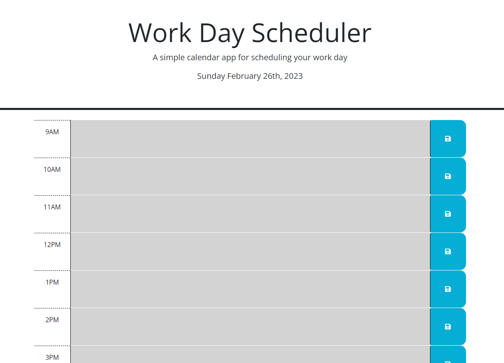

# Daily-Planner

# Description
This project is a daily planner that will show the user the current date and has 8 hours worth of time slots on the screen for the user to fill out and save. This uses local storage to save the tasks and can be updated throughout the day.

# Specifications 
This project will give the user a chance to keep up with their hectic schedule by adding there tasks to the time slot given. The user can then click on the save button to the right and have that box saved to local storage for them to come back to later. They can even update it throughout the day and have no worries that anything is going to be lost. Once each hour has past the page will change the past hours grey, the current hour red, and the future hours green. This keeps its easy for users to keep up throughout the day and easily find where they are in their busy days.

# Deployed Site
## [Live URL](https://mjlynch123.github.io/Daily-Schedule/)